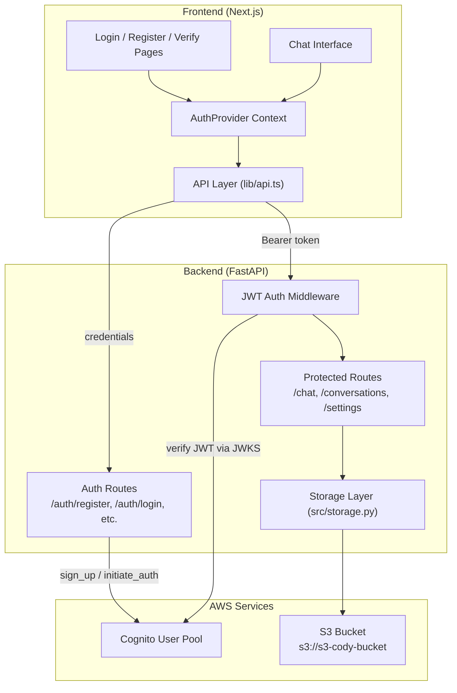
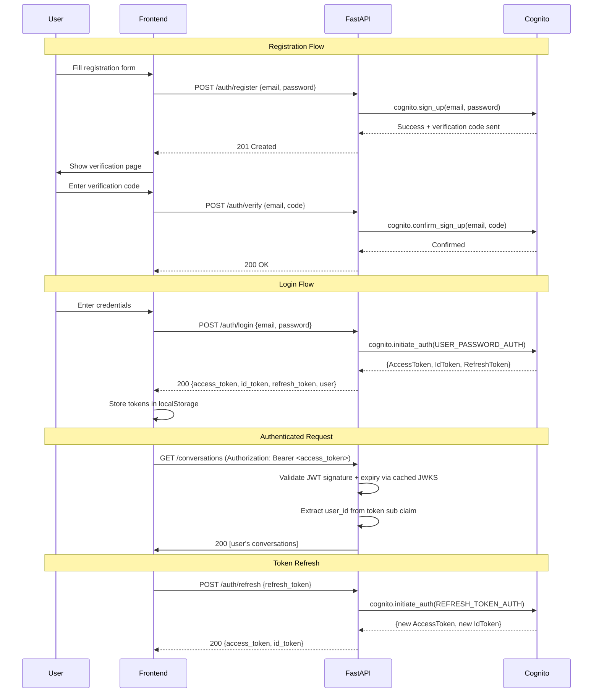

# Design Document: User Authentication

## Overview

This design introduces user authentication to the Cody AI Agent application using AWS Cognito as the identity provider. The system adds registration, login, JWT-based route protection, per-user conversation isolation, and user preferences. The backend (FastAPI) integrates with Cognito via boto3 for user management and validates JWTs on protected routes. The frontend (Next.js) manages auth state through a React context provider and stores tokens in localStorage.

### Design Decisions

1. **AWS Cognito over custom auth**: Cognito handles password hashing, email verification, token lifecycle, and rate limiting — reducing attack surface and development effort.
2. **Backend-proxied Cognito calls**: The FastAPI server proxies sign-up/sign-in to Cognito rather than having the frontend call Cognito directly. This keeps Cognito configuration (pool ID, client ID) server-side and allows unified error handling.
3. **PyJWT + JWKS for token verification**: Using `PyJWT` with Cognito's public JWKS endpoint for stateless JWT verification. JWKS keys are cached to avoid per-request network calls.
4. **localStorage for token persistence**: Tokens are stored in localStorage for session persistence across page reloads. The refresh token enables silent re-authentication.
5. **S3 path-based isolation**: Conversations are isolated by prefixing S3 keys with the user's Cognito `sub` claim — no database needed for ownership checks.

## Architecture

### High-Level System Diagram



### Authentication Flow



## Components and Interfaces

### Backend Components

#### 1. Auth Router (`src/auth.py`)

Handles registration, login, verification, token refresh, and logout.

```python
# POST /auth/register
async def register(request: RegisterRequest) -> RegisterResponse:
    """
    Register a new user via Cognito sign_up.
    Returns 201 on success, 409 if email exists, 400 if password policy violated.
    """

# POST /auth/verify
async def verify(request: VerifyRequest) -> MessageResponse:
    """
    Confirm user email with verification code.
    Returns 200 on success, 400 if code invalid/expired.
    """

# POST /auth/login
async def login(request: LoginRequest) -> TokenResponse:
    """
    Authenticate user via Cognito initiate_auth (USER_PASSWORD_AUTH).
    Returns tokens on success, 401 if invalid credentials, 403 if unverified.
    """

# POST /auth/refresh
async def refresh(request: RefreshRequest) -> TokenResponse:
    """
    Obtain new access/id tokens using refresh token.
    Returns 200 with new tokens, 401 if refresh token invalid/expired.
    """

# POST /auth/logout
async def logout(user_id: str) -> MessageResponse:
    """
    Invalidate user session in Cognito (global sign-out).
    """
```

#### 2. Auth Middleware (`src/middleware.py`)

FastAPI dependency that validates JWTs on protected routes.

```python
from fastapi import Depends, HTTPException, Request
from fastapi.security import HTTPBearer, HTTPAuthorizationCredentials

security = HTTPBearer()

class JWTVerifier:
    """
    Verifies Cognito JWTs using cached JWKS public keys.
    Caches keys for 1 hour to reduce network calls.
    """
    def __init__(self, user_pool_id: str, region: str, client_id: str):
        self.jwks_url = f"https://cognito-idp.{region}.amazonaws.com/{user_pool_id}/.well-known/jwks.json"
        self.issuer = f"https://cognito-idp.{region}.amazonaws.com/{user_pool_id}"
        self.client_id = client_id
        self._jwks_cache = None
        self._cache_time = 0

    async def verify_token(self, token: str) -> dict:
        """
        Verify JWT signature, expiry, issuer, and audience.
        Returns decoded claims on success, raises HTTPException on failure.
        """

    async def get_jwks(self) -> dict:
        """Fetch and cache JWKS from Cognito endpoint."""

async def get_current_user(
    credentials: HTTPAuthorizationCredentials = Depends(security)
) -> str:
    """
    FastAPI dependency. Extracts and validates Bearer token.
    Returns user_id (Cognito sub claim).
    Raises 401 for missing/invalid/expired tokens.
    """
```

#### 3. User Settings Router (`src/settings.py`)

```python
# GET /settings
async def get_settings(user_id: str = Depends(get_current_user)) -> UserSettings:
    """
    Retrieve user settings from S3.
    Returns defaults if no settings file exists.
    """

# PUT /settings
async def update_settings(
    settings: UserSettingsUpdate,
    user_id: str = Depends(get_current_user)
) -> UserSettings:
    """
    Validate and persist user settings to S3.
    Returns 400 if validation fails.
    """
```

#### 4. Updated Storage Layer (`src/storage.py`)

Modified to support per-user conversation paths.

```python
def _key(user_id: str, conversation_id: str) -> str:
    """Build user-scoped S3 key: conversations/{user_id}/{conversation_id}.json"""
    return f"{PREFIX}/{user_id}/{conversation_id}.json"

def list_conversations(user_id: str) -> list[dict]:
    """List conversations belonging to a specific user."""

def load_conversation(user_id: str, conversation_id: str) -> dict | None:
    """Load a conversation, scoped to user."""

def save_conversation(user_id: str, conversation_id: str, title: str, messages: list) -> None:
    """Save a conversation under the user's prefix."""

def delete_conversation(user_id: str, conversation_id: str) -> bool:
    """Delete a conversation only if it belongs to the user."""
```

#### 5. Migration Endpoint (`src/migration.py`)

```python
# POST /admin/migrate-conversations
async def migrate_conversations(admin_user_id: str) -> MigrationResponse:
    """
    One-time migration: moves conversations/{id}.json to conversations/{admin_user_id}/{id}.json.
    Idempotent — returns success if already migrated.
    """
```

### Frontend Components

#### 1. AuthProvider (`src/lib/AuthContext.tsx`)

```typescript
interface AuthState {
  user: User | null;
  isAuthenticated: boolean;
  isLoading: boolean;
}

interface AuthContextType extends AuthState {
  login: (email: string, password: string) => Promise<void>;
  register: (email: string, password: string) => Promise<{ needsVerification: boolean }>;
  verify: (email: string, code: string) => Promise<void>;
  logout: () => Promise<void>;
  refreshToken: () => Promise<void>;
}

// Token management:
// - Stores access_token, id_token, refresh_token in localStorage
// - Attaches Bearer token to all API requests via api layer
// - Intercepts 401 responses to trigger silent refresh
// - Redirects to /login if refresh fails
```

#### 2. Auth Pages

| Page | Route | Purpose |
|------|-------|---------|
| LoginPage | `/login` | Email + password sign-in form |
| RegisterPage | `/register` | Email + password + confirm registration form |
| VerifyPage | `/verify` | Verification code input after registration |

#### 3. Route Protection (`src/components/ProtectedRoute.tsx`)

```typescript
// Wraps protected pages. If not authenticated, redirects to /login.
// If authenticated, renders children.
function ProtectedRoute({ children }: { children: ReactNode }): JSX.Element
```

#### 4. Updated API Layer (`src/lib/api.ts`)

```typescript
// Modified request() function to:
// 1. Attach Authorization: Bearer <access_token> header
// 2. Intercept 401 responses
// 3. Attempt token refresh on 401
// 4. Retry original request with new token
// 5. If refresh fails, clear tokens and redirect to /login

// New auth endpoints:
api.register(email: string, password: string): Promise<RegisterResponse>
api.verify(email: string, code: string): Promise<void>
api.login(email: string, password: string): Promise<TokenResponse>
api.refresh(refreshToken: string): Promise<TokenResponse>
api.logout(): Promise<void>
api.getSettings(): Promise<UserSettings>
api.updateSettings(settings: UserSettingsUpdate): Promise<UserSettings>
```

### Route Classification

| Route | Type | Auth Required |
|-------|------|---------------|
| `GET /health` | Public | No |
| `POST /auth/register` | Public | No |
| `POST /auth/verify` | Public | No |
| `POST /auth/login` | Public | No |
| `POST /auth/refresh` | Public | No |
| `GET /tools` | Public | No |
| `POST /auth/logout` | Protected | Yes |
| `POST /chat` | Protected | Yes |
| `POST /chat/stream` | Protected | Yes |
| `GET /conversations` | Protected | Yes |
| `GET /conversations/{id}` | Protected | Yes |
| `DELETE /conversations/{id}` | Protected | Yes |
| `PATCH /conversations/{id}` | Protected | Yes |
| `GET /settings` | Protected | Yes |
| `PUT /settings` | Protected | Yes |
| `POST /admin/migrate-conversations` | Protected | Yes |

## Data Models

### Backend Models (Pydantic)

```python
# --- Auth Request/Response Models ---

class RegisterRequest(BaseModel):
    email: str  # validated as email format
    password: str  # min 8 chars, uppercase, lowercase, number, special char

class VerifyRequest(BaseModel):
    email: str
    code: str  # 6-digit verification code

class LoginRequest(BaseModel):
    email: str
    password: str

class RefreshRequest(BaseModel):
    refresh_token: str

class TokenResponse(BaseModel):
    access_token: str
    id_token: str
    refresh_token: str | None = None  # Not returned on refresh
    user: UserInfo

class UserInfo(BaseModel):
    user_id: str  # Cognito sub
    email: str

class MessageResponse(BaseModel):
    message: str

# --- User Settings Models ---

class UserSettings(BaseModel):
    display_name: str  # 1-50 chars
    theme: Literal["light", "dark"]
    language: Literal["en", "fr", "ar"]

class UserSettingsUpdate(BaseModel):
    display_name: str | None = None  # 1-50 chars if provided
    theme: Literal["light", "dark"] | None = None
    language: Literal["en", "fr", "ar"] | None = None
```

### Frontend Types (`src/lib/types.ts`)

```typescript
// --- Auth Types ---

interface User {
  user_id: string;
  email: string;
}

interface TokenResponse {
  access_token: string;
  id_token: string;
  refresh_token?: string;
  user: User;
}

interface RegisterResponse {
  message: string;
}

// --- Settings Types ---

interface UserSettings {
  display_name: string;
  theme: "light" | "dark";
  language: "en" | "fr" | "ar";
}

interface UserSettingsUpdate {
  display_name?: string;
  theme?: "light" | "dark";
  language?: "en" | "fr" | "ar";
}
```

### S3 Storage Schema

```
s3://s3-cody-bucket/
├── conversations/
│   └── {user_id}/                    # Cognito sub (UUID)
│       └── {conversation_id}.json    # Conversation data
└── settings/
    └── {user_id}.json                # User preferences
```

**Conversation JSON** (unchanged structure, new path):
```json
{
  "id": "a1b2c3d4",
  "title": "Weather Forecast Discussion",
  "updated_at": "2024-01-15T10:30:00",
  "messages": [
    {"role": "user", "content": "What's the weather?"},
    {"role": "assistant", "content": "...", "steps": [...], "latency_ms": 1200}
  ]
}
```

**Settings JSON**:
```json
{
  "display_name": "John Doe",
  "theme": "dark",
  "language": "en"
}
```

### Environment Variables (Backend)

```
COGNITO_USER_POOL_ID=eu-north-1_XXXXXXXXX
COGNITO_CLIENT_ID=xxxxxxxxxxxxxxxxxxxxxxxxxx
COGNITO_REGION=eu-north-1
```


## Correctness Properties

*A property is a characteristic or behavior that should hold true across all valid executions of a system — essentially, a formal statement about what the system should do. Properties serve as the bridge between human-readable specifications and machine-verifiable correctness guarantees.*

### Property 1: Password Validation Correctness

*For any* string input, the password validator SHALL report exactly the set of violated rules (missing uppercase, missing lowercase, missing digit, missing special character, fewer than 8 characters) that are actually violated by that string — accepting only strings that satisfy all rules simultaneously.

**Validates: Requirements 1.4**

### Property 2: JWT Verification Correctness

*For any* JWT token string, the auth middleware SHALL accept the token if and only if it has a valid signature from the configured JWKS, has not expired, has the correct issuer, and contains a sub claim — and when accepted, SHALL extract the exact sub value from the token's claims.

**Validates: Requirements 3.1, 3.3, 3.4, 3.5**

### Property 3: Conversation Isolation

*For any* authenticated user and any set of conversations stored across multiple users, listing conversations SHALL return only conversations belonging to the requesting user, loading a specific conversation SHALL succeed only if it belongs to the requesting user, and deleting SHALL remove only conversations belonging to the requesting user.

**Validates: Requirements 4.1, 4.2, 4.3, 4.4, 4.5**

### Property 4: Settings Round-Trip Preservation

*For any* valid UserSettings object and any user, storing the settings and then retrieving them SHALL produce an object equal to the original input.

**Validates: Requirements 5.1, 5.2**

### Property 5: Settings Validation Correctness

*For any* UserSettings input object, the settings validator SHALL accept the input if and only if display_name is 1-50 characters, theme is one of "light" or "dark", and language is one of "en", "fr", or "ar" — rejecting all other inputs with the appropriate field-level error messages.

**Validates: Requirements 5.4, 5.5**

### Property 6: Protected Route Redirect

*For any* protected route in the application, when the user is not authenticated, the frontend SHALL redirect to the login page without rendering the protected content.

**Validates: Requirements 6.4**

### Property 7: Auth Page Redirect for Authenticated Users

*For any* authentication page (login, register, verify), when the user is already authenticated, the frontend SHALL redirect to the main chat interface without rendering the auth form.

**Validates: Requirements 6.5**

### Property 8: Token Storage Round-Trip

*For any* set of tokens (access_token, id_token, refresh_token) received from a successful login response, the Auth_Provider SHALL store them such that subsequent retrieval from localStorage returns the identical token values.

**Validates: Requirements 7.1**

### Property 9: Bearer Token Attachment

*For any* API request to a protected endpoint, the request SHALL include an Authorization header with value "Bearer {access_token}" where access_token is the currently stored access token.

**Validates: Requirements 7.2**

### Property 10: Migration Data Preservation

*For any* conversation stored in the legacy format (conversations/{id}.json), after migration to the new format (conversations/{admin_user_id}/{id}.json), the message content, title, and timestamps SHALL be identical to the original.

**Validates: Requirements 9.2**

## Error Handling

### Backend Error Handling Strategy

| Error Source | HTTP Status | Error Response Format |
|-------------|-------------|----------------------|
| Invalid email format | 400 | `{"detail": "Invalid email format"}` |
| Password policy violation | 400 | `{"detail": "Password must contain: ...", "violations": [...]}` |
| Invalid/expired verification code | 400 | `{"detail": "Verification code is invalid or expired"}` |
| Email already registered | 409 | `{"detail": "An account with this email already exists"}` |
| Invalid credentials | 401 | `{"detail": "Invalid email or password"}` |
| Account not verified | 403 | `{"detail": "Account requires email verification"}` |
| Missing Authorization header | 401 | `{"detail": "Not authenticated"}` |
| Expired access token | 401 | `{"detail": "Token has expired"}` |
| Invalid/tampered token | 401 | `{"detail": "Invalid token"}` |
| Expired refresh token | 401 | `{"detail": "Refresh token expired, please login again"}` |
| Access to other user's conversation | 403 | `{"detail": "Forbidden"}` |
| Invalid settings values | 400 | `{"detail": "Validation error", "errors": {"field": "reason"}}` |
| Cognito service unavailable | 503 | `{"detail": "Authentication service temporarily unavailable"}` |

### Security Considerations

1. **Generic login errors**: Never reveal whether the email exists or the password is wrong — always return the same message "Invalid email or password".
2. **Token exposure**: Access tokens are short-lived (1 hour, Cognito default). Refresh tokens have a longer lifetime (30 days).
3. **CORS tightening**: Replace `allow_origins=["*"]` with explicit frontend origin(s) in production.
4. **Rate limiting**: Cognito provides built-in rate limiting for auth operations. Additional application-level rate limiting via the existing `rate_limiter.py`.
5. **S3 path traversal**: Validate conversation_id format (alphanumeric, 8 chars) before constructing S3 keys to prevent path traversal attacks.

### Frontend Error Handling

```typescript
// Error interceptor pattern in api.ts:
// 1. API returns error → parse response body for detail message
// 2. Display error in form UI (inline below field or as toast)
// 3. 401 on protected route → attempt token refresh
// 4. Refresh fails → clear state, redirect to /login
// 5. Network error → show "Connection error, please try again"
```

## Testing Strategy

### Property-Based Tests (Backend — Python)

**Library**: `hypothesis` (Python property-based testing framework)
**Configuration**: Minimum 100 examples per property test

| Property | Test Target | Generator Strategy |
|----------|-------------|-------------------|
| P1: Password validation | `validate_password()` | Random strings (0-100 chars, all unicode) |
| P2: JWT verification | `JWTVerifier.verify_token()` | Random JWT payloads signed with test keys (valid/invalid/expired/wrong issuer) |
| P3: Conversation isolation | `storage.list_conversations()`, `storage.load_conversation()` | Random user IDs + conversation data for multiple users |
| P4: Settings round-trip | `storage.save_settings()` + `storage.load_settings()` | Random valid settings objects |
| P5: Settings validation | `validate_settings()` | Random settings with varying field values |
| P10: Migration preservation | `migrate_conversations()` | Random conversation JSON objects |

Each test is tagged: **Feature: user-authentication, Property {N}: {property_text}**

### Property-Based Tests (Frontend — TypeScript)

**Library**: `fast-check` (JavaScript/TypeScript property-based testing framework)
**Configuration**: `numRuns: 100`

| Property | Test Target | Generator Strategy |
|----------|-------------|-------------------|
| P6: Protected route redirect | `ProtectedRoute` component | All protected route paths |
| P7: Auth page redirect | Login/Register/Verify pages | All auth page paths with authenticated state |
| P8: Token storage round-trip | `AuthProvider` login handler | Random token strings |
| P9: Bearer token attachment | `api.request()` | Random endpoint paths + random token strings |

### Unit Tests (Example-Based)

**Backend** (pytest):
- Registration: duplicate email → 409, valid registration → 201
- Login: invalid credentials → 401, unverified account → 403, success → tokens
- Verification: invalid code → 400, expired code → 400, valid code → 200
- Token refresh: expired refresh → 401, valid refresh → new tokens
- Logout: calls Cognito global_sign_out
- Settings defaults: no settings file → returns defaults
- Public routes: accessible without auth header

**Frontend** (vitest + React Testing Library):
- LoginPage renders with email, password fields, submit button
- RegisterPage renders with email, password, confirm fields
- VerifyPage renders with code input
- Error messages displayed inline on validation failure
- Logout button visible when authenticated
- Logout clears localStorage and redirects
- 401 triggers automatic token refresh
- Refresh failure clears tokens and redirects to login

### Integration Tests

- Full registration → verification → login flow (mocked Cognito)
- Conversation CRUD with per-user isolation (mocked S3)
- Migration endpoint moves conversations correctly (mocked S3)
- SSE streaming with authenticated request

### Dependencies to Add

**Backend** (`requirements.txt`):
```
PyJWT==2.9.0
cryptography==44.0.0
httpx==0.28.0  # for async JWKS fetching
```

**Frontend** (`package.json`):
```json
{
  "dependencies": {
    "jose": "^5.9.0"  // (optional) for client-side token decoding
  },
  "devDependencies": {
    "vitest": "^3.2.0",
    "@testing-library/react": "^16.0.0",
    "fast-check": "^4.0.0"
  }
}
```
